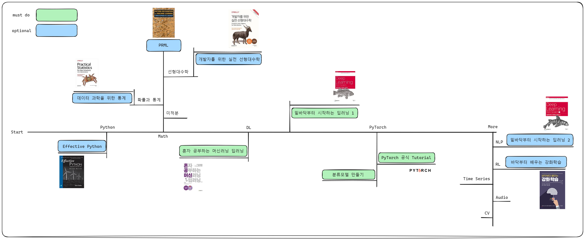

# CURRICULUM

---

## 추가로 보면 좋은 자료

**선형대수학**
- [3blue1brown](https://www.youtube.com/watch?v=fNk_zzaMoSs&list=PLZHQObOWTQDPD3MizzM2xVFitgF8hE_ab)
- [혁펜하임](https://www.youtube.com/watch?v=7vV2SF8DyQE&list=PL_iJu012NOxdZDxoGsYidMf2_bERIQaP0)

**미적분**
- [3blue1brown](https://www.youtube.com/watch?v=WUvTyaaNkzM&list=PLZHQObOWTQDMsr9K-rj53DwVRMYO3t5Yr)

**머신러닝, 딥러닝 기초**
- [3blue1brown](https://www.youtube.com/watch?v=aircAruvnKk&list=PLZHQObOWTQDNU6R1_67000Dx_ZCJB-3pi)
- [혁펜하임](https://www.youtube.com/watch?v=IJRxpLgT7oE&list=PL_iJu012NOxdDZEygsVG4jS8srnSdIgdn)

**PyTorch 기초**
- [이수안 컴퓨터 연구소](https://www.youtube.com/watch?v=k60oT_8lyFw)

**Kaggle**
- [House price](https://www.kaggle.com/competitions/house-prices-advanced-regression-techniques/overview)
- [Titanic](https://www.kaggle.com/competitions/titanic)

---

## Advanced
- [Deep dive to DL](https://d2l.ai/index.html)
- [Deep learning by Ian Goodfellow and Yoshua Bengio and Aaron Courville](https://www.deeplearningbook.org/)
- [Mathematics for Machine Learning by Marc Peter Deisenroth, A. Aldo Faisal, and Cheng Soon Ong](https://mml-book.github.io/)
- [Probabilistic Machine Learning: An Introduction by Kevin Patrick Murphy](https://probml.github.io/pml-book/book1.html)

---

### Computer Vision
- [CS231n](https://youtube.com/playlist?list=PLC1qU-LWwrF64f4QKQT-Vg5Wr4qEE1Zxk&si=lDQgDHXiUWrIwh6D)

### Natural Language Process
- [딥러닝을 이용한 자연어 처리 입문](https://wikidocs.net/book/2155)
- [Pytorch로 시작하는 딥러닝 입문](https://wikidocs.net/52415)

### RecSYS

### RL

### Timeseires

